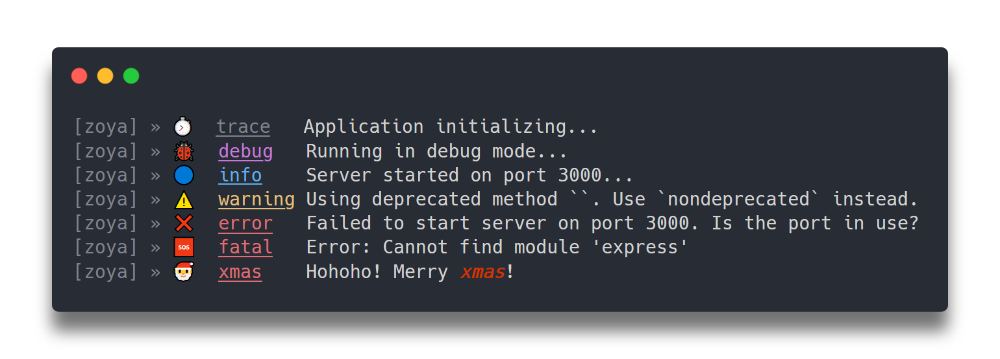

# Carbon Links

  <a href="https://carbon.now.sh/?bg=rgba(210%252C210%252C210%252C1)&t=one-dark&wt=none&l=application%252Ftypescript&ds=true&dsyoff=15px&dsblur=12px&wc=true&wa=true&pv=36px&ph=40px&ln=false&fl=1&fm=Hack&fs=14px&lh=133%2525&si=false&es=2x&wm=false&code=%25255Bzoya%25255D%252520%2525C2%2525BB%252520%2525E2%25258F%2525B1%2525EF%2525B8%25258F%252520%252520trace%252520%252520%252520Application%252520initializing...%25250A%25255Bzoya%25255D%252520%2525C2%2525BB%252520%2525F0%25259F%252590%25259E%252520%252520debug%252520%252520%252520Running%252520in%252520debug%252520mode...%25250A%25255Bzoya%25255D%252520%2525C2%2525BB%252520%2525F0%25259F%252594%2525B5%252520%252520info%252520%252520%252520%252520Server%252520started%252520on%252520port%2525203000...%25250A%25255Bzoya%25255D%252520%2525C2%2525BB%252520%2525E2%25259A%2525A0%2525EF%2525B8%25258F%252520%252520warning%252520Using%252520deprecated%252520method%252520%252560%252560.%252520Use%252520%252560nondeprecated%252560%252520instead.%25250A%25255Bzoya%25255D%252520%2525C2%2525BB%252520%2525E2%25259D%25258C%252520%252520error%252520%252520%252520Failed%252520to%252520start%252520server%252520on%252520port%2525203000.%252520Is%252520the%252520port%252520in%252520use%25253F%25250A%25255Bzoya%25255D%252520%2525C2%2525BB%252520%2525F0%25259F%252586%252598%252520%252520fatal%252520%252520%252520Error%25253A%252520Cannot%252520find%252520module%252520'express'%25250A%25255Bzoya%25255D%252520%2525C2%2525BB%252520%2525F0%25259F%25258E%252585%252520%252520xmas%252520%252520%252520%252520Hohoho!%252520Merry%252520xmas!">
    
    Header
  </a>

---
